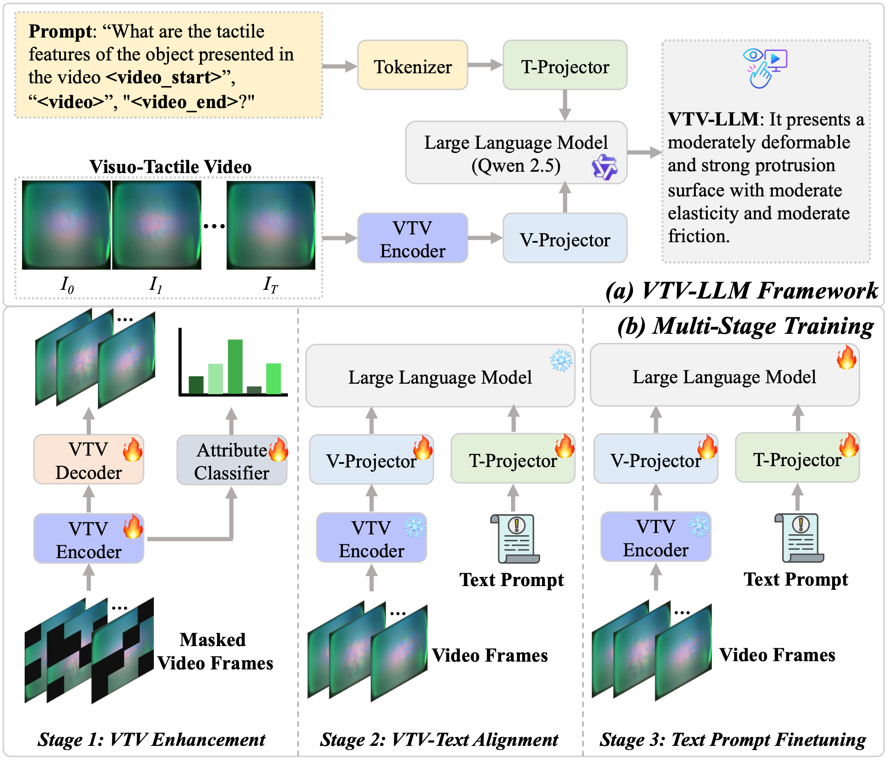

# Universal Visuo-Tactile Video Understanding for Embodied Interaction (NeurIPS 2025)
PyTorch implementation of the paper:
[Universal Visuo-Tactile Video Understanding for Embodied Interaction](https://arxiv.org/abs/2505.22566).



## Environment and Data Preparation
Please refer to [environment.yaml](environment.yaml).

The original video dataset can be downloaded from [huggingface](https://huggingface.co/datasets/Ivan416/VBTS_video).
Then, run the following commands to generate the complete VTV150K dataset.
```
python utils/process_dataset_video.py --dataset_path $your_path$ --output_path $your_path$ --seed 0
python utils/generate_qa_video.py --data_path $your_path$ --seed 0
```

## Training

For Stage 1, you can download the pretrained VBTS video encoder from [huggingface](https://huggingface.co/Ivan416/VBTS_video_encoder) and modify the [encoder_path](configs/train_llm_config.yaml#L16).

For Stage 2 and 3, you can modify the corresponding parameters in [train_llm_config.yaml](configs/train_llm_config.yaml), and then do training:
```
python train_llm.py --config configs/train_llm_config.yaml --exp_id stage2_run
```


## Citation
If you find our work useful in your research, please consider citing:
```latex
@article{xie2025universal,
  title={Universal Visuo-Tactile Video Understanding for Embodied Interaction},
  author={Xie, Yifan and Li, Mingyang and Li, Shoujie and Li, Xingting and Chen, Guangyu and Ma, Fei and Yu, Fei Richard and Ding, Wenbo},
  journal={arXiv preprint arXiv:2505.22566},
  year={2025}
}
```
